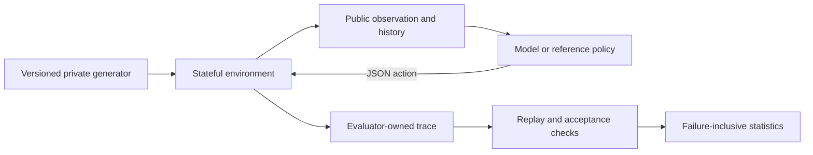
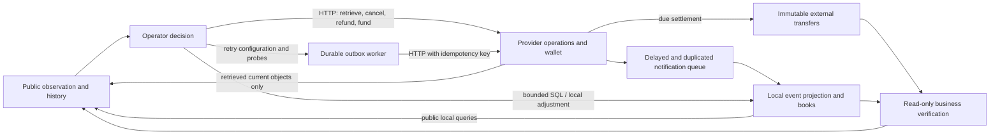

# Design from the task outward

The accepted next mainline is [incident takeover](INCIDENT_TAKEOVER.md): sparse
handover, agent-discovered tools and evidence amid operational noise, actual
consequences without evaluator coaching, and independent outcome grading. The first
[PostgreSQL candidate](POSTGRES_TAKEOVER.md) is implemented in 2.13; this is not a difficulty result. The existing
family mechanisms below retain their versioned semantics.

## The durable question

An agent is delegated an outcome before it knows everything needed to produce it. It must select observations and interventions using the history available at that moment. Its actions consume resources and change what remains possible. Evaluation must therefore inspect both the achieved state and the sequence that produced it.

This motivates four contracts:

1. **World:** a stateful environment with explicit transition and observation rules.
2. **Delegation:** a business goal, authorized work entry point, and acceptance grounded in the goal and accessible business requirements. How tools, costs and action consequences become known is family-specific; the next mainline requires discovery rather than an incident-specific action/risk catalogue.
3. **Agent:** a policy receiving only public information.
4. **Evidence:** an evaluator-owned trajectory and independently recomputable outcome.

These contracts can survive changes in model architecture, provider, context length, and inference settings. They also allow failures to be explained without knowing private training recipes.

The agent path has no edge to the private generator, answer key or grader. This is an information boundary enforced by the HTTP request builder; in-process Python baselines remain trusted code.

## Why the project started with a diagnostic kernel

The historical experiment found useful behavior differences in one small simulator. Generalizing the research requires removing answer leakage, fixed-cost dependence, model-name assumptions, and weak acceptance semantics before adding more elaborate scenarios.

The v2 kernel varies hypothesis count, overlapping diagnostic partitions, costs, observation reliability, and task depth. A phase is initially ambiguous. Tests narrow the possibilities. Intervention can unlock an entirely new diagnostic catalogue. A correct early action is insufficient for acceptance when the later phase remains unresolved.

Cheap noisy evidence and expensive reliable evidence permit different information strategies. The exact reference planner deliberately uses only reliable tests, providing a reproducible guarantee of solvability without claiming an optimum over every risky policy. Episodes allow wrong actions and rollback; their cost stays spent.

The generator chooses a budget from the worst-case cost of this **public-information policy over all possible answers**, plus verification and a small slack. It never selects the budget from the sampled hidden answer. This avoids turning the budget into an answer hint and prevents generating impossible episodes by accident.

## Measurement boundaries

The original diagnostic environment is a controlled decision problem. Candidate hypotheses and test likelihoods are explicitly listed. Later catalogues are hidden until an intervention, but the protocol itself is known. This isolates information selection and control from domain expertise and natural-language retrieval.

The `cascade` family introduces sequential revelation and reset of beliefs, but still uses the diagnostic kernel. It is not an arbitrary causal world simulator. `incident` and `data_pipeline` currently alter the task description only; they are semantic controls, not evidence of broad domain coverage.

The framework does not yet establish:

- discovery of an initially unknown hypothesis space;
- learning an unknown transition law;
- long-term memory under lossy context;
- negotiation of hidden user preferences;
- visual/desktop competence or broad repository-level competence;
- the real-world cost of human supervision;
- predictive validity on external work tasks.

These are concrete extension and validation targets, not properties inferred from calling a task a POMDP. See [the roadmap](ROADMAP.md).

The separate [offline discovery/recovery prototype](DISCOVERY_RECOVERY.md) now
tests obtaining an initially unavailable preparation operation and rebuilding
after an announced dependency replacement invalidates completed work and a PASS.
Its visible/hidden and stable/changing ablations distinguish discovery from
revision handling. These are fixed development fixtures, not a new scored family,
general hypothesis-space discovery, or independent population samples. The
released diagnostic kernel and the broader validity boundaries above are unchanged.

## Fair information and acceptance

The remote model receives a JSON allowlist: contract, current observation, and public history. It never receives the case identifier, generation seed, sampled answer, run directory, manifest, or hidden score. Synthetic reference policies receive the same representation. Repository-repair actions expose only the pinned task workspace; no action exposes evaluator files or rewrites the oracle.

Built-in Python policies execute in the evaluator process and are trusted code. Passing them JSON is an interface discipline, not an OS security boundary. New untrusted local agents require a separate sandbox or remote service with no access to the evaluator's files, environment, or process memory.

Existing families require explicit handover after a passing verification of the current revision. A failed verification is not acceptance. A later mutation invalidates a previous pass even when that mutation is subsequently undone. A green dashboard does not substitute for verification. The next incident-takeover family instead separates agent-chosen operational checks from evaluator-owned outcome grading; it will not expose a privileged PASS gate or grade on a prescribed command sequence. This requires new semantics, not a retrospective change to old families.

## Separate measurements from interpretations

The framework measures completion, action costs, explicit shortcut attempts, and observable mistakes. It does not infer a model's intentions from prose or equate a failed action with deliberate deception. `tests_after_certainty` has a precise meaning in this generator: the reliable observations already leave exactly one possible hypothesis in the current phase.

The open/principles/procedural tracks share the same acceptance contract and tool information. Only policy assistance changes. The procedural track supplies several control rules together. Its success gain is therefore a **prompt intervention effect**, not an identified decomposition of intrinsic capability. A causal claim about budget discipline, stopping, or replanning requires one-component ablations.

A budget-loss event uses the clairvoyant minimum remaining repair/rollback/verification cost. Crossing this bound proves that completion is unaffordable even with perfect information. Staying above it does not prove that an observation-limited policy can still succeed. Noisy evidence can legitimately justify more investigation; it is never counted as exact certainty.

## Efficiency and product relevance

Evaluate what a deployed model configuration can deliver. Record its declared reasoning setting, wall time, provider-reported token usage, tool budget, and failures. Equal FLOPs are not required for the default product comparison. A training-mechanism study can add its own controls without redefining the product track.

An operational action point is a synthetic resource, not a token or dollar. Report them separately. Batch cost divided by accepted completions counts failed attempts honestly, but does not assume that rerunning failures would be independent or equally difficult. Missing provider usage stays missing.

## Validity before leaderboard growth

Difficulty must also survive model improvement. The small reactive discovery
prototype is a contract test, not evidence of high difficulty. The new
`dependency-cover/1` kernel introduces global compatibility under constrained
work and selective invalidation. Its [difficulty contract](DIFFICULTY.md) requires
competent heuristic comparisons, rescue ablations, strong-model ceiling/floor
checks and immutable anchors before extending the ladder. Neither size nor
scripted-control separation by itself establishes frontier headroom.

Framework 2.6 makes useful-tool availability an explicit ablation. The coverage
solver reads the same revealed rows as the model and returns a suggestion only;
its calls and deterministic search effort are reported separately. The simple
tool-consumer policy already succeeds across the qualified depth cases. This
limits coverage's claim as a general agent benchmark: unaided combinatorial
search and tool-equipped workflow are distinct constructs. A future family must
leave consequential information/action decisions after useful computation is
available, rather than relying on ever larger catalogues alone.

Synthetic families need a public-information positive control and designed failures. Real repair fixtures use known accepted patches as artifact controls until public-information policies are measured; the two are never conflated. Cosmetic-success policies must fail. State mutation requires re-verification. Sources and budgets are pinned, with answer-bearing metadata excluded.

Fresh seeds help prevent exact-instance memorization. They do not prevent a model from learning the public generator's structure. Structural profiles, held-out generator variants, and external tasks are separate tests. A profile becomes held-out by the experimental protocol, not by its name.

Published studies should freeze their suite and evaluation version. As models approach ceiling, add and calibrate a new version while keeping the earlier version available. Do not silently make existing scores harder or easier. Benchmark progress should be interpretable over time.

## Why there is no single autonomy score

Success, cost, failure recovery, intervention sensitivity, and shortcut attempts answer different deployment questions. Weighting them into a single number imposes an application-specific utility function. The default output preserves the dimensions and the task distribution. An application may define weights before evaluation and publish them alongside its results.

## Real delivery and the complete interaction

The 2.8 localized one-shot model screen omitted investigation and feedback.
It cannot establish progress on the project's central agent-policy question.
Framework 2.9 restores that question through an [executable service incident](SERVICE_INCIDENT.md):
HTTP delivery, durable accounting, operator decisions, consequences and recovery.
The local business system is constructed; actual production predictive validity
still needs external evidence. Infrastructure and source-repair checks are components,
not substitutes for complete model trajectories.

Framework 2.7 directly evaluates a real repository repair. The agent acquires
source details through reads/searches, proposes edits, executes checks and
delivers a patch. The partially observed state includes the defect's cause and
the consequences of a proposed change; the full source is not supplied up front.
A compact observation describes the revision, remaining resources and latest
tool result. There is no complete hypothesis catalogue or built-in repair solver.

The [repair contract](REPOSITORY_REPAIR.md) uses a pinned upstream snapshot,
isolated candidate execution and an evaluator-owned behavioral oracle. Its first
public defect validates this loop, with six artifact controls and a targeted
regression suite. Broader task difficulty is the next concrete development step.

The [R0–R3 route](ROADMAP.md) removes additional synthetic studies and history
compression as prerequisites. Prospective prediction and measured supervision
burden remain research targets; actual accepted patches provide immediate
application evidence within their declared task scope.

## External effects are not local bookkeeping

Framework 2.10 adds [external settlement](EXTERNAL_SETTLEMENT.md). The provider's
append-only transfer history is independent of the local book projection. A local
adjustment has no edge to that history. The operator must cancel a pending duplicate
or complete a separately funded refund; observing a stale event cannot make either
operation happen. Verification reads both outcomes and never drains work.

The new family removes staged restarts and mixed payload parsing from its task:
those already have an earlier anchor. Its decisions concern irreversible external
commitment, finite recovery resources and conflicting evidence. Both families reuse
bounded HTTP/SQL plumbing and the same action-bound evidence collector. More service
count, more documentation, or another parser failure would not establish difficulty.

## Actual component rules rather than configuration presets

Framework 2.11 implements [cross-component reconciliation repair](RECONCILIATION_REPAIR.md).
The agent edits executable SQL, observes intermediate rows, deploys and recovers
materialized state. Separate provider truth checks both individual object lineage
and business totals. This reuses the incident interaction/evidence state machine;
there is no second collector or localized one-shot submission flow. The two public
contracts need different normalization semantics. Qualification and strong-route
calibration remain separate: executable source repair alone is not hard-task evidence.

## Coupled repair and irreversible recovery (2.12)

[Refund recovery](REFUND_RECOVERY.md) reuses the external provider and bounded SQL runtime. The operator repairs decode/project/dispatch rules while recovering uncertain and failed partial refunds. Acceptance checks independent transfer history per intent and order, and each refund projection. Correct aggregate totals cannot hide allocation errors. This remains a constructed candidate; a strong-route success rejects the high-difficulty claim.
