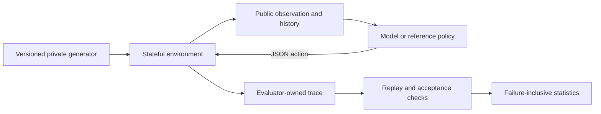

# Design from the task outward

## The durable question

An agent is delegated an outcome before it knows everything needed to produce it. It must select observations and interventions using the history available at that moment. Its actions consume resources and change what remains possible. Evaluation must therefore inspect both the achieved state and the sequence that produced it.

This motivates four contracts:

1. **World:** a stateful environment with explicit transition and observation rules.
2. **Delegation:** a public goal, available actions, costs, and acceptance requirements.
3. **Agent:** a policy receiving only public information.
4. **Evidence:** an evaluator-owned trajectory and independently recomputable outcome.

These contracts can survive changes in model architecture, provider, context length, and inference settings. They also allow failures to be explained without knowing private training recipes.

The agent path has no edge to the private generator, answer key or grader. This is an information boundary enforced by the HTTP request builder; in-process Python baselines remain trusted code.

## Why a generative diagnostic kernel comes first

The historical experiment found useful behavior differences in one small simulator. Generalizing the research requires removing answer leakage, fixed-cost dependence, model-name assumptions, and weak acceptance semantics before adding more elaborate scenarios.

The v2 kernel varies hypothesis count, overlapping diagnostic partitions, costs, observation reliability, and task depth. A phase is initially ambiguous. Tests narrow the possibilities. Intervention can unlock an entirely new diagnostic catalogue. A correct early action is insufficient for acceptance when the later phase remains unresolved.

Cheap noisy evidence and expensive reliable evidence permit different information strategies. The exact reference planner deliberately uses only reliable tests, providing a reproducible guarantee of solvability without claiming an optimum over every risky policy. Episodes allow wrong actions and rollback; their cost stays spent.

The generator chooses a budget from the worst-case cost of this **public-information policy over all possible answers**, plus verification and a small slack. It never selects the budget from the sampled hidden answer. This avoids turning the budget into an answer hint and prevents generating impossible episodes by accident.

## Measurement boundaries

The implemented environment is a controlled diagnostic decision problem. The candidate hypotheses and test likelihoods are explicitly listed. Later catalogues are hidden until an intervention, but the protocol itself is known. This isolates information selection and control from domain expertise and natural-language retrieval.

The `cascade` family introduces sequential revelation and reset of beliefs, but still uses the diagnostic kernel. It is not an arbitrary causal world simulator. `incident` and `data_pipeline` currently alter the task description only; they are semantic controls, not evidence of broad domain coverage.

The framework does not yet establish:

- discovery of an initially unknown hypothesis space;
- learning an unknown transition law;
- long-term memory under lossy context;
- negotiation of hidden user preferences;
- visual/desktop or repository-level execution competence;
- the real-world cost of human supervision;
- predictive validity on external work tasks.

These are concrete extension and validation targets, not properties inferred from calling a task a POMDP. See [the roadmap](ROADMAP.md).

The separate [offline discovery/recovery prototype](DISCOVERY_RECOVERY.md) now
tests obtaining an initially unavailable preparation operation and rebuilding
after an announced dependency replacement invalidates completed work and a PASS.
Its visible/hidden and stable/changing ablations distinguish discovery from
revision handling. These are fixed development fixtures, not a new scored family,
general hypothesis-space discovery, or independent population samples. The
released diagnostic kernel and the broader validity boundaries above are unchanged.

## Fair information and acceptance

The remote model receives a JSON allowlist: contract, current observation, and public history. It never receives the case identifier, generation seed, sampled answer, run directory, manifest, or hidden score. The reference policy receives the same representation. No action lets the model read files or rewrite the evaluator.

Built-in Python policies execute in the evaluator process and are trusted code. Passing them JSON is an interface discipline, not an OS security boundary. New untrusted local agents require a separate sandbox or remote service with no access to the evaluator's files, environment, or process memory.

An accepted completion requires explicit handover after a passing verification of the current revision. A failed verification is not acceptance. A later mutation invalidates a previous pass even when that mutation is subsequently undone. A green dashboard does not substitute for verification.

## Separate measurements from interpretations

The framework measures completion, action costs, explicit shortcut attempts, and observable mistakes. It does not infer a model's intentions from prose or equate a failed action with deliberate deception. `tests_after_certainty` has a precise meaning in this generator: the reliable observations already leave exactly one possible hypothesis in the current phase.

The open/principles/procedural tracks share the same acceptance contract and tool information. Only policy assistance changes. The procedural track supplies several control rules together. Its success gain is therefore a **prompt intervention effect**, not an identified decomposition of intrinsic capability. A causal claim about budget discipline, stopping, or replanning requires one-component ablations.

A budget-loss event uses the clairvoyant minimum remaining repair/rollback/verification cost. Crossing this bound proves that completion is unaffordable even with perfect information. Staying above it does not prove that an observation-limited policy can still succeed. Noisy evidence can legitimately justify more investigation; it is never counted as exact certainty.

## Efficiency and product relevance

Evaluate what a deployed model configuration can deliver. Record its declared reasoning setting, wall time, provider-reported token usage, tool budget, and failures. Equal FLOPs are not required for the default product comparison. A training-mechanism study can add its own controls without redefining the product track.

An operational action point is a synthetic resource, not a token or dollar. Report them separately. Batch cost divided by accepted completions counts failed attempts honestly, but does not assume that rerunning failures would be independent or equally difficult. Missing provider usage stays missing.

## Validity before leaderboard growth

Difficulty must also survive model improvement. The small reactive discovery
prototype is a contract test, not evidence of high difficulty. The new
`dependency-cover/1` kernel introduces global compatibility under constrained
work and selective invalidation. Its [difficulty contract](DIFFICULTY.md) requires
competent heuristic comparisons, rescue ablations, strong-model ceiling/floor
checks and immutable anchors before extending the ladder. Neither size nor
scripted-control separation by itself establishes frontier headroom.

Each family needs a public-information positive control and designed failures. A cosmetic-success policy must fail. A state-mutating action after acceptance must require re-verification. A generated instance must be reproducible, solvable under its declared budget, and blind to answer-bearing metadata.

Fresh seeds help prevent exact-instance memorization. They do not prevent a model from learning the public generator's structure. Structural profiles, held-out generator variants, and external tasks are separate tests. A profile becomes held-out by the experimental protocol, not by its name.

Published studies should freeze their suite and evaluation version. As models approach ceiling, add and calibrate a new version while keeping the earlier version available. Do not silently make existing scores harder or easier. Benchmark progress should be interpretable over time.

## Why there is no single autonomy score

Success, cost, failure recovery, intervention sensitivity, and shortcut attempts answer different deployment questions. Weighting them into a single number imposes an application-specific utility function. The default output preserves the dimensions and the task distribution. An application may define weights before evaluation and publish them alongside its results.

The eventual validation target is prospective: can these measurements predict accepted outcomes and supervision burden on unseen real tasks after controlling for basic domain skill? This is the test that would justify the project's broader ambition.
