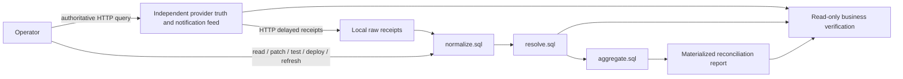

# Cross-component reconciliation repair — reconciliation-repair/1

Framework 2.11 adds two constructed development contracts. The previous external
settlement task was solvable with known settings and a provider query. Here the
operator must repair actual SQL transformations, deploy them and recover stored
business output. This qualifies a code-repair capability; it does not by itself
establish high difficulty or predictive validity on production incidents.

## Business and architecture

| Contract | Input meaning | Consequential rules |
|---|---|---|
| Capture snapshots | Complete captured/refunded state, two coexisting wire schemas | Merchant-scoped capture identity; generation before revision; integer versus decimal monetary units; snapshots replace rather than sum |
| Posting corrections | Multiple charges/refunds on one invoice, with replacement revisions | Entry identity rather than invoice; merchant scope; current revision; status and refund sign; preserve negative and zero entries |

Both use the following path:



SQL is the task's real executable source, not a choice from a repair catalogue.
The operator reads current component source, stages replacements, executes a dry
run with intermediate results, deploys atomically, and explicitly refreshes the
historical output. Deployment never silently backfills. A failed pipeline leaves
the previous materialized output intact. Newly received events make it stale again.

The provider has a separate file-backed database and a real loopback HTTP server.
Ordinary local SQL can inspect raw receipts and materialized intermediate/output
tables, not the provider or future notifications. `provider all` exposes current
authoritative positions without repairing any local state. This useful tool is
deliberately retained. Fixture truth consists of explicitly specified financial
positions; it does not reuse the candidate or reference SQL decoder.

## Public information and actions

The initial request contains the business goal, action interfaces and acceptance
requirements. `inspect contract` explains the upstream semantics; `source` gives
the actual active/staged SQL; `schema`, `pipeline`, `timing`, `operations` and
`metrics` supply the remaining operational information. No case/profile/seed,
solution code, future feed or hidden audit enters an agent request. Tests return
actual stage output, not a hidden expected answer. Verification exposes discrepancy
counts; authoritative expected positions are available through the public API.

Actions are `inspect`, `query`, `provider`, `patch`, `test`, `deploy`, `refresh`,
`workload`, `wait`, `verify`, `finish`. `patch` accepts one stage and replacement SQL.
There is no named configuration preset that fixes the pipeline. The public SQL
interfaces have exact columns because downstream components consume those columns.
Runtime errors return as ordinary action feedback and can be repaired in the episode.

Each component executes in a fresh SQLite database with only its preceding public
input. A SQLite authorizer allows reads of that one table and documented classes
of deterministic functions, grouping, JSON extraction and windows. The exact
`minor(value,currency,unit)` helper handles USD/JPY/KWD without floating-point money.
No shell, Python, extensions, ATTACH, host files, provider tables or oracle are
exposed. Limits are 6,000 SQL characters, 256 rows and 1,000,000 VM instructions per
stage. These bounds fit all supplied inputs; they are not the intended difficulty.

## Time, delivery and acceptance

80 actions include handover. Each normal action acts first, then advances one tick
and ingests currently available HTTP feed receipts. Reads and rejected actions also
advance. Valid `verify` and `finish` are stable read-only boundaries. There is no
business deadline or wall-clock-dependent state in this family.

`workload 1` submits one new batch, up to three; at least two are required. Events
arrive within eight ticks, with duplicate receipts and older revisions arriving
late. The workload exercises the same published contract, not an undisclosed rule.
No automatic work occurs inside verification. Every intervening action other than
valid verification/handover invalidates a PASS, including inspection.

Acceptance requires all of:

- Every current business object exactly once, with correct merchant, currency and
  amount, including zero and negative positions.
- Correct totals per merchant and currency; equal aggregate totals cannot hide
  wrong object attribution.
- No pending receipts; materialized output bound to current active SQL and all
  received data; at least two new workload batches.
- A passing verification of the current state followed by explicit handover.

The evaluator compares business rows as multisets. It never matches source text to
the reference patch. Different correct SQL is accepted. Source patches, intermediate
observations, private audit consequences and all failures are retained in full traces.
Recorded replay does not execute SQL; `recheck` independently executes the HTTP/SQL
world again and compares every action response. These claims remain distinct.

## Qualification and limits

The public-contract operator is hand-written for these documented contracts. It
does not access case IDs or private audits, but is not a general repair solver.
Partial normalization, one fixed resolver, global identity, omission of generation,
positive-only totals and omission of backfill are declared controls. The same
generation omission is harmless for revision-only postings, which checks that the
rule is applied where relevant rather than indiscriminately rewarded.

These are two authored contract fixtures sharing implementation and financial
domain, not a representative independent task sample. Probe batches are not new
tasks. Fixed published fixtures permit overfitting; repeated runs do not establish
contamination resistance. A model can implement the complete known contracts; that
is legitimate success. If strong models succeed readily, this family remains a
repair regression anchor and does not pass the frontier-difficulty gate.

Migration: 2.11 introduces a new family and separate suite/manifest. Old task
semantics and frozen evidence remain unchanged. Do not pool these outcomes with
external-settlement or earlier incident results.

## Run

```console
python -m pomdp_bench prepare-reconciliation-suite --out artifacts/reconciliation-suite.json
python -m pomdp_bench run --suite artifacts/reconciliation-suite.json --agents examples/reconciliation-agents.json --out artifacts/reconciliation
python -m pomdp_bench validate artifacts/reconciliation
python -m pomdp_bench recheck artifacts/reconciliation
```
